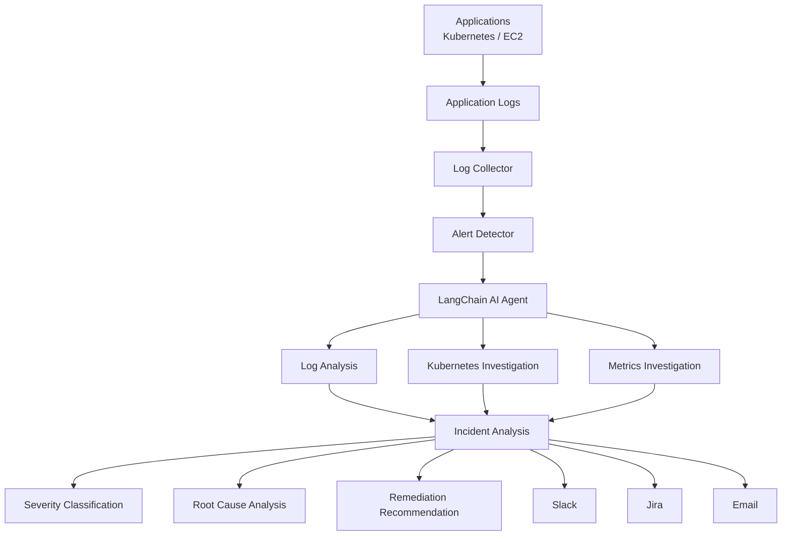

# ai-log-monitoring-agent
AI Log Monitoring &amp; Alert Triage Agent — Built a LangChain-based AI agent that analyzes application logs, classifies alert severity, identifies probable root causes, and recommends remediation steps, reducing manual log-review effort.

## Architecture

Agent:

1. Search recent logs
2. Detect repeated database timeout
3. Check Kubernetes pod status
4. Detect CrashLoopBackOff
5. Inspect pod logs
6. Detect OOMKilled
7. Check recent deployment
8. Determine probable cause
9. Generate incident summary
10. Send Slack notification
